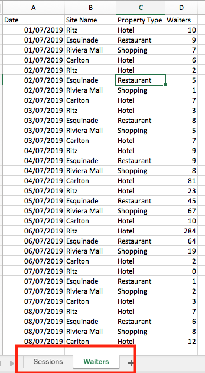
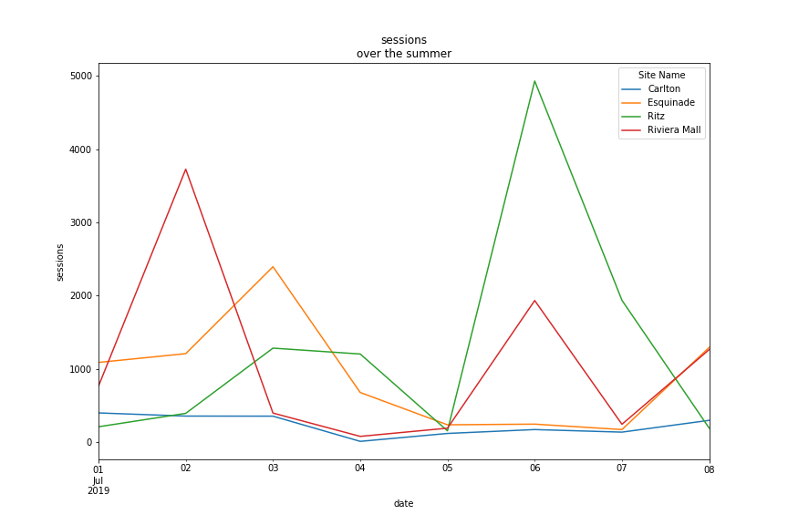
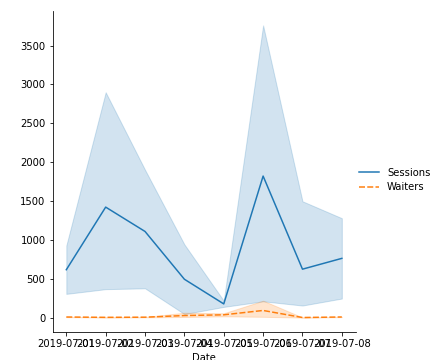

---
jupyter:
  jupytext:
    cell_metadata_filter: all,-hidden,-heading_collapsed,-run_control,-trusted
    custom_cell_magics: kql
    notebook_metadata_filter: all, -jupytext.text_representation.jupytext_version,
      -jupytext.text_representation.format_version, -language_info.version, -language_info.codemirror_mode.version,
      -language_info.codemirror_mode, -language_info.file_extension, -language_info.mimetype,
      -toc
    text_representation:
      extension: .md
      format_name: markdown
  kernelspec:
    display_name: Python 3 (ipykernel)
    language: python
    name: python3
  language_info:
    name: python
    nbconvert_exporter: python
    pygments_lexer: ipython3
---

# dessins par groupby

et lire plusieurs feuillets depuis excel


le fichier excel `data/groupby-draw.xlsx` contient ici plusieurs feuillets





les deux feuillets contiennent 2 données différentes pour les mêmes sites / dates


## ce qu'il faut faire


A. visualiser les deux données (Sessions et Waiters) en fonction du temps par site

e.g.




B. mêmes chiffres mais agrégés sur les sites, les deux caratéristiques sur une seule figure (ici avec seaborn)



```python
# à vous

# imports ...

import pandas as pd
import seaborn as sns
import matplotlib.pyplot as plt
```

```python
plt.rcdefaults()
df1 = pd.read_excel('data/groupby-draw.xlsx', sheet_name='Sessions')
df2 = pd.read_excel('data/groupby-draw.xlsx', sheet_name='Waiters')
df = pd.merge(df1, df2)
dfp = df.pivot(
    index='Date',
    values='Sessions',
    columns='Site Name'
)
dfp.plot(figsize=(10,6))
plt.xlabel('Date')
plt.ylabel('Sessions')
plt.title('sessions \n over the summer')

```

```python
dfp
```

```python
plt.rcdefaults()
ax1=sns.lineplot(data=df, x='Date', y='Sessions')
ax2=sns.lineplot(data=df, x='Date', y='Waiters', linestyle='dashed')
plt.legend(['Sessiosn','_nolegend_','Waiters'], loc='center left', bbox_to_anchor=(1, 0.5))
```

---
